# Week 1 — App Containerization

---
## Pick the right cloud role: A beginners guide! - “The Cloud” is not a job

## Keynotes

## My journey to the cloud

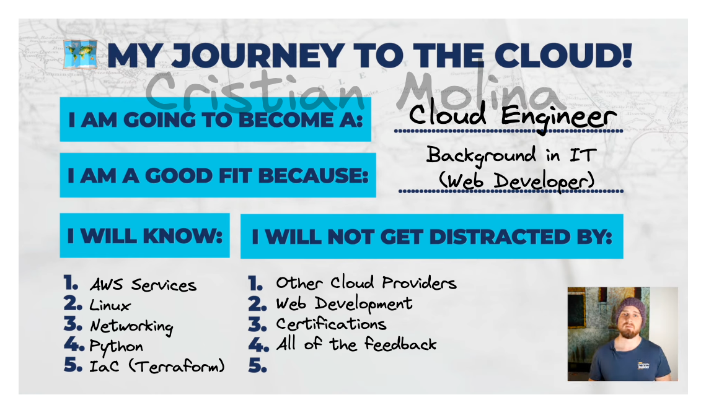

## Most common roles in the cloud industry

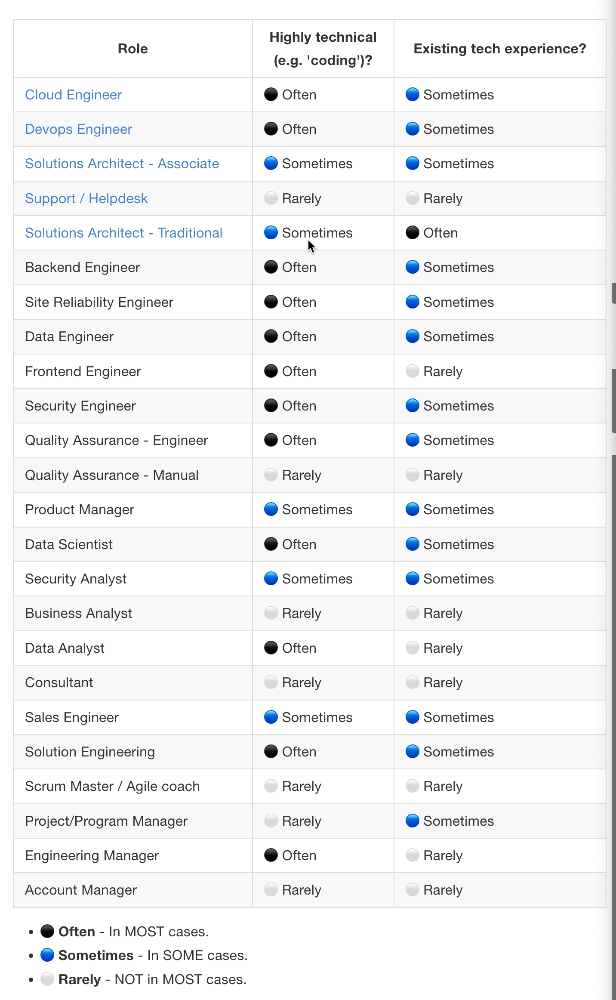

## Cloud noob deadly sins

### Sin #1. Badge Collector

- There is no correlation between certifications and job roles and titles
- Certifications aren't the only way that you can create evidence for your skills
- Getting certifications is not enough for land jobs
    
    ### Credibility
    
- When you're getting into the industry you want to think about credibility. How credible are you for the job that you are applying to do and with that you also want to build evidence concrete evidence that you are credible of that job
- Certification is a particularly low barrier to entry most of the time . e.g. (For some certifications in AWS all you need is a bit of cash to pass the Amazon initial entry-level)
- The barrier to entry is quite low
- Contributing to Open Source projects  can have quite a high barrier to entry because you have to have a certain level of standard to raise a pull request or a code change into an open source
- professional experience is higher barrier to entry to land job as a professional person in the cloud and also it shows a depth of experience.

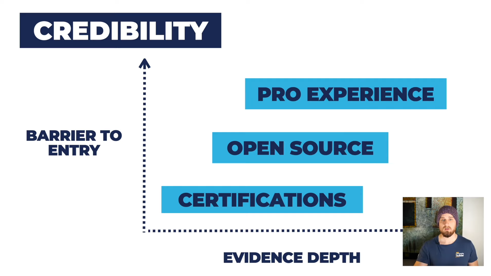

### The “GAP” (Your Skills and The Job)

- Looking the job market and looking at the roles exist and looking at the skills that the market is demanding is very important
- Projects are a great way of plugging the Gap. Show employers bring evidence, make a project, build it to sufficient depth, add complexity in it
- Freelance is an option. You can do is reach out to your network, if you have a family or a relative that runs some sort of business that you can automate some aspect of their business. You could use them as a stakeholder
- Teamwork is very commonly forgotten.
- Link up with some other people, work together on the project. Cloud building things is often a team sport and very rarely are you working entirely on your own.

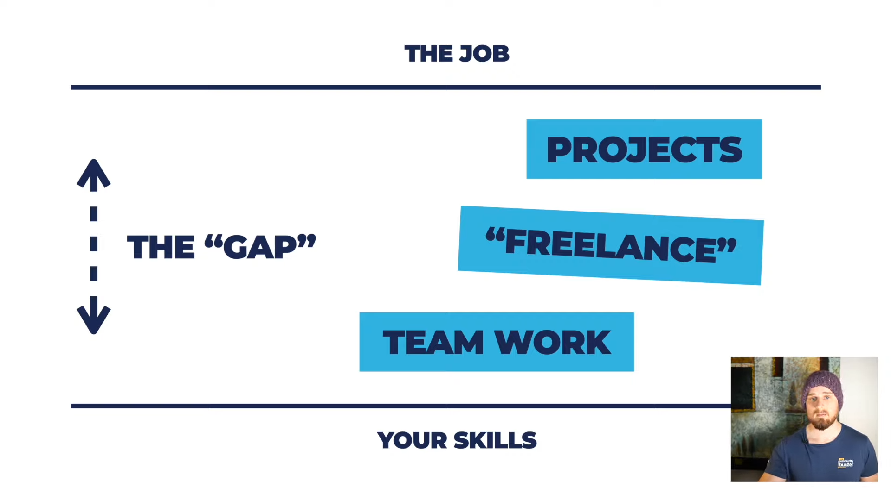

### Sin #2. The “Hide and Seek” Champion

- The “Hike and Seek” Champion. People that spend all their time learning in their comfort zone and don't actually go out and test themselves against the job market
- Don't treat the job hunt like it happens at the end of the process start it from the beginning expose yourself to the feedback loop of the job market.
- You don't have to take all of the feedback that you get from different people, If you're not careful before you know it you're getting pushed in many different directions and you might be pushed into directions that you don't want to go they're not in line with your direction.
- Start to build your resume, start to apply for jobs, start to interview because that's going to create a feedback loop that will help you refine your learning plan

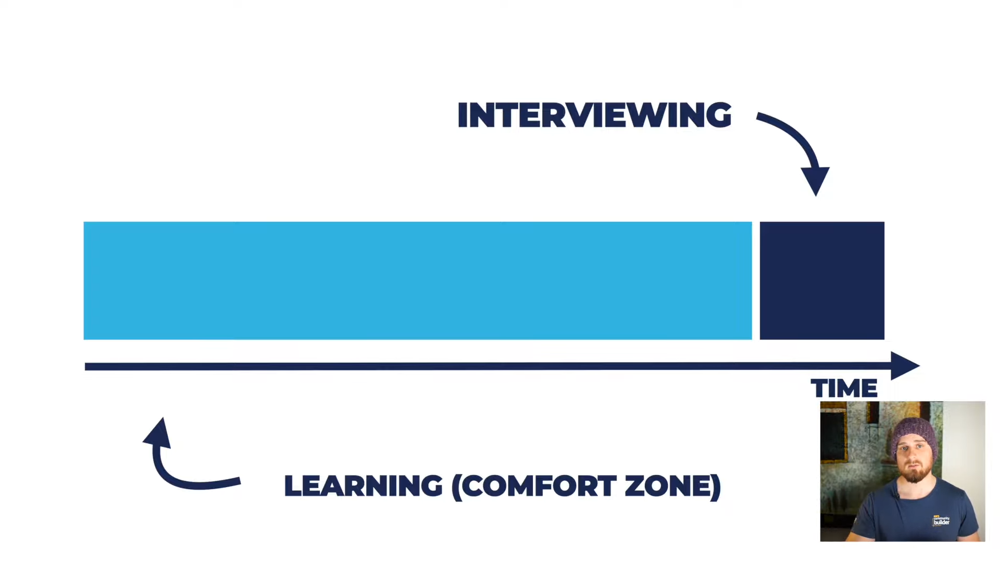

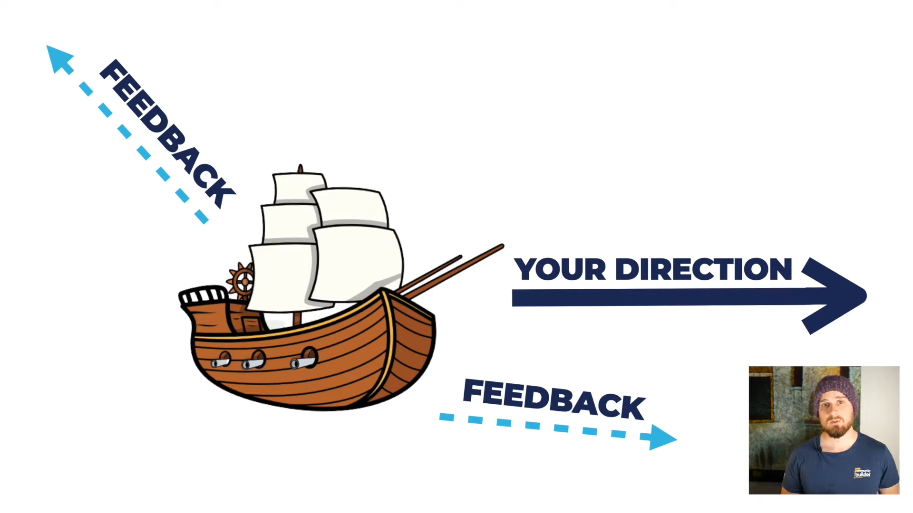

### Sin #3. Ash Ketchum

- Ash Ketchum is to want to catch all the different skills in the cloud.
- Pick selective skills that align with the job that you're trying to apply for rather than looking at all of these different skills.

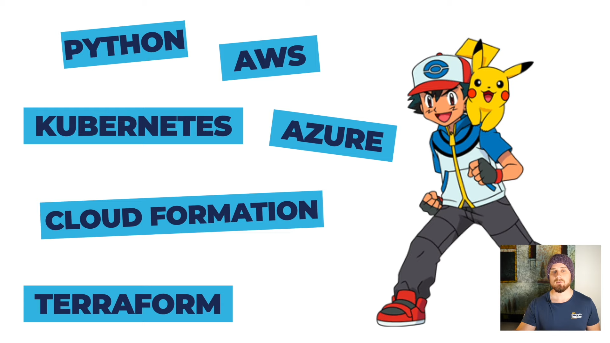

### Skills Roadmap Golden Rules

- Those skills complement each other or do they pull each other in different directions? Do they play well together? Do they build a nice set of skills?
- Do Skills support your goal, do they bring you closer towards it or are they aligned with a different goal?
- You'll find a lot of Technologies within the cloud industry are similar to each other.

### Working Births

- Once you've got your skills, start to think about how you can work across small periods of time.
- You're going to get your head down, you're going to focus, you're going to build out your skills and really build some depth and at the end of that then you can seek feedback

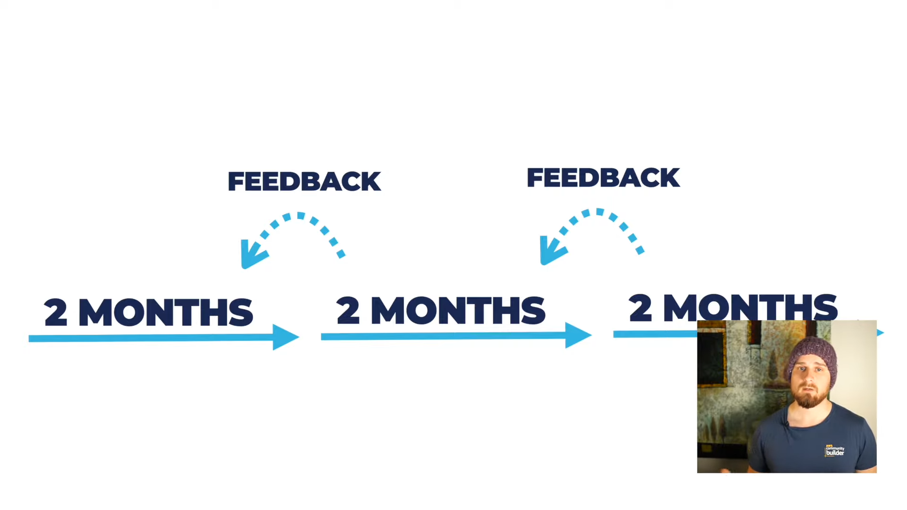

## 4 Cloud Role Groups

There’s no perfect way to group cloud roles.

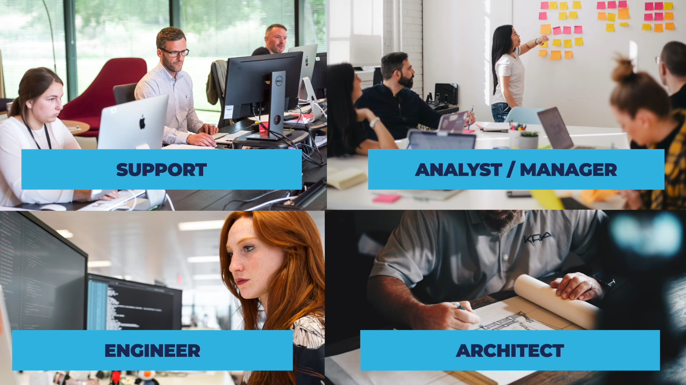

### Support

- not as technical.
- more people oriented.
- popular as entry
level cloud role.
- can help if you have
little professional
experience.
- Roles: Help Desk, Support, Manual QA, Account Manager.

### Manager/Analyst

- More people oriented
- Using business skills
- Facilitation, communication, stakeholders.
- Can be a good opportunity if you have existing experience.
- Roles: Business analyst, Data analyst, Security analyst., Account/sales executive, Product manager, Project manager, Solutions architect(client-facing).

### Engineer

- Highly technical
- Coding, building, implementing
- More introverted, less interested in working with people.
- Roles: Software Engineer, Devops Engineer, Site Reliability Engineer, Cloud Engineer, Data Engineer, Security Engineer, Qa Engineer,Sales Engineer.

### Architect

- Visionary, High Level
Design
- Business + Tech
- Lots Of Interaction With Stakeholders
- Persuasion
- Communication.
- Roles: Cloud Architect, Network Architect, Solutions Architect

### Reminders

- The journey is not a direct linear process. Everyone's journey is completely different so don't worry it can be a bit of a whining journey and your journey might be different to other people

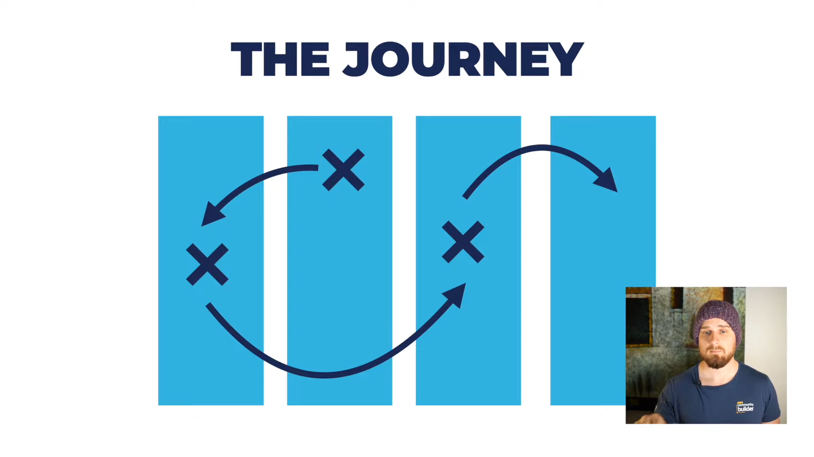

- Where you start is not where you end up. You can start with one different role and then change.

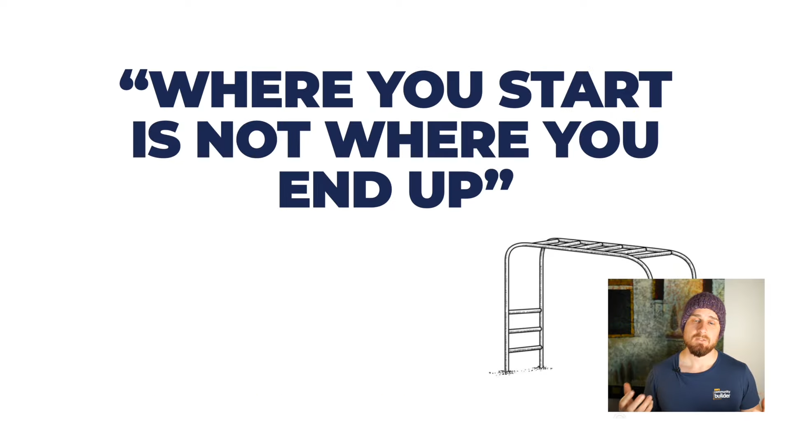